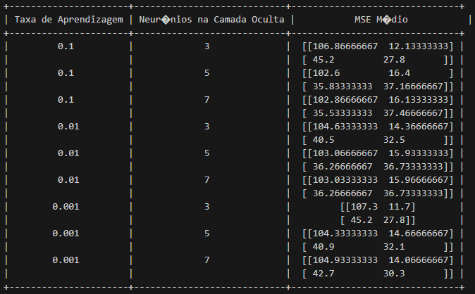

# Relatorio
O objetivo deste trabalho é desenvolver e analisar um classificador utilizando o algoritmo Perceptron de Múltiplas Camadas (MLP) para prever a classe de um conjunto de dados relacionados à diabetes.

### Carregamento e Normalização dos Dados
A biblioteca Pandas foi utilizada para carregar o conjunto de dados relacionado à diabetes a partir do arquivo 'diabetes_csv.csv'. Para garantir que todas as características do conjunto de dados estivessem na mesma escala, as variáveis preditoras foram normalizadas. Essa normalização é crucial para assegurar um treinamento eficaz do modelo MLP. A linha de código abaixo realiza a normalização:

`df[preditoras] = df[preditoras] / df[preditoras].max()`

`df[preditoras]`: seleciona todas as colunas de variáveis preditoras no DataFrame.

`df[preditoras].max()`: calcula o valor máximo para cada coluna de variável preditora.

### Divisão do Conjunto de Dados

O conjunto de dados foi dividido em conjuntos de treino e teste (75% treino, 25% teste) usando a função `train_test_split` da biblioteca scikit-learn. `train_test_split` Divide o conjunto de dados em dois subconjuntos independentes: um para treinamento do modelo e outro para avaliação, proporcionando uma valiação mais robusta do modelo.

### Configuração do Modelo MLP

O modelo MLP foi configurado da seguinte forma:
* Três camadas ocultas, cada uma contendo 8 neurônios.
* Número máximo de iterações: 1500.
* Função de ativação: 'relu'.
* Solver: 'adam'.

As funções de ativação 'relu' e o otimizador 'adam' foram escolhidos devido ao seu desempenho eficaz em problemas de classificação e treinamento de redes neurais.

### Experimentos e Resultados
Foram conduzidos experimentos variando a taxa de aprendizagem e o número de neurônios na camada oculta. Para cada combinação, o treinamento foi executado e o modelo avaliado 30 vezes, registrando as matrizes de confusão resultantes.

#### Saida do código:

A variação da taxa de aprendizagem não demonstrou uma influência significativa no desempenho do modelo, conforme evidenciado pela similaridade nos MSEs médios para diferentes taxas. Aumentar o número de neurônios na camada oculta teve um impacto positivo no desempenho do modelo, refletido na redução dos valores de MSE médio.
