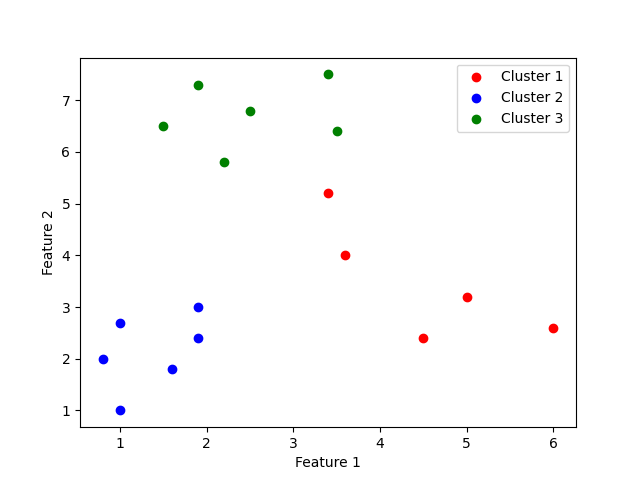

# Atividade K-means
Projeto para complementar a II Unidade da diciplina de sistemas inteligentes
## O que deve ser feito:

### Ache 3 clusters utilizando k-means.

Esses são os dados que serão utlizado para a atividade
|    |    |    |
|----|----|----|
| 1 | 1,9 | 7,3 |
| 2 | 3,4 | 7,5 |
| 3 | 2,5 | 6,8 |
| 4 | 1,5 | 6,5 |
| 5 | 3,5 | 6,4 |
| 6 | 2,2 | 5,8 |
| 7 | 3,4 | 5,2 |
| 8 | 3,6 | 4 |
| 9 | 5 | 3,2 |
| 10 | 4,5 | 2,4 |
| 11 | 6 | 2,6 |
| 12 | 1,9 | 3 |
| 13 | 1 | 2,7 |
| 14 | 1,9 | 2,4 |
| 15 | 0,8 | 2 |
| 16 | 1,6 | 1,8 |
| 17 | 1 | 1 |

## Grafico de dispersão dos dados acima

## Bibliotecas usadas no código
Foram usadas 3 bibliotecas:
* Scikit-learn (sklearn): Uma biblioteca em Python que oferece ferramentas para análise de dados e modelagem, incluindo algoritmos de aprendizado de máquina.

* NumPy: Utilizado para manipulação eficiente de arrays multidimensionais.

* Matplotlib: Usado para a visualização dos resultados.

## Dados Obtidos:

### 1º Cluster

|    | Feature 1 | Feature 2 | Feature 3 | Cluster |
|----|-----------|-----------|-----------|---------|
| 7  | 3.4       | 5.2       | 0.        | 0       |
| 8  | 3.6       | 4.0       | 0.        | 0       |
| 9  | 5.0       | 3.2       | 0.        | 0       |
| 10 | 4.5       | 2.4       | 0.        | 0       |
| 11 | 6.0       | 2.6       | 0.        | 0       |

### 2º Cluster

|    | Feature 1 | Feature 2 | Feature 3 | Cluster |
|----|-----------|-----------|-----------|---------|
| 12 | 1.9       | 3.0       | 1.        | 1       |
| 13 | 1.0       | 2.7       | 1.        | 1       |
| 14 | 1.9       | 2.4       | 1.        | 1       |
| 15 | 0.8       | 2.0       | 1.        | 1       |
| 16 | 1.6       | 1.8       | 1.        | 1       |
| 17 | 1.0       | 1.0       | 1.        | 1       |

### 3º Cluster

|   | Feature 1 | Feature 2 | Feature 3 | Cluster |
|---|-----------|-----------|-----------|---------|
| 1 | 1.9       | 7.3       | 2.        | 2       |
| 2 | 3.4       | 7.5       | 2.        | 2       |
| 3 | 2.5       | 6.8       | 2.        | 2       |
| 4 | 1.5       | 6.5       | 2.        | 2       |
| 5 | 3.5       | 6.4       | 2.        | 2       |
| 6 | 2.2       | 5.8       | 2.        | 2       |

## Grafico de dispersão dos dados obtidos:

